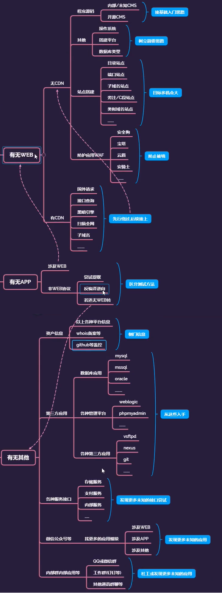

## CDN(多网)

CDN(内容分发网络)通过遍布全国的缓存边缘节点、内部专用线路以及完善的网络路由调度机制为用户自动选择最佳网络访问路径，将源站的内容分发到最接近用户的网络边缘节点，解决用户访问速度慢的问题，提供全方位的更快、更稳定、更便捷的网络访问体验。

## WAF(Web Application Firewall)

网站应用级入侵防御系统，web应用防火墙是通过一些列针对HTTP/HTTPS的安全册罗来专门为Web应用提供保护的一款产品

## CMS(Content Management System)

意为"内容管理系统"。 

内容管理系统（content management system，CMS）是一种位于WEB 前端（Web 服务器）和后端办公系统或流程（内容创作、编辑）之间的软件系统。内容的创作人员、编辑人员、发布人员使用内容管理系统来提交、修改、审批、发布内容。这里指的“内容”可能包括文件、表格、图片、数据库中的数据甚至视频等一切你想要发布到Internet、Intranet以及Extranet网站的信息。

内容管理还可选地提供内容抓取工具，将第三方信息来源，比如将文本文件、HTML网页、Web服务、关系数据库等的内容自动抓取，并经分析处理后放到自身的内容库中。

随着个性化的发展，内容管理还辅助WEB前端将内容以个性化的方式提供给内容使用者，即提供个性化的门户框架，以基于WEB技术将内容更好地推送到用户的浏览器端。

## 站点搭建

### 目录站点

/bbs/	论坛

### 端口站点

:8080

通过开放的端口，分析站点开启了哪些服务

### 子域名站点

同一ip：

**bbs**.goodlift.net

**www**.goodlift.net

不同ip：

www.etiantian.com

web.etiantian.com

### 类似域名站点

### 旁注，C段站点

#### 旁注：同服务器不同站点

前提条件：该服务器有多个站点

例如：192.168.1.100

​			www.a.com

​			www.b.com

可以通过找到b的漏洞来攻击a站点

#### C段：同网段不同服务器不同站点（困难）

前提条件：独立站点服务器，该服务器只有一个站点利用

例如：192.168.1.100

​			www.a.com

​			

例如：192.168.1.101

​			www.b.com

​			

### 搭建软件特征站点

phpstudy、宝塔等

shodan（一款黑暗搜索引擎）

## APP

[漏了个大洞.zip_免费高速下载|百度网盘-分享无限制 (baidu.com)](https://pan.baidu.com/s/13_i1ExwEaA59GfMt1Rp0Hg?_at_=1626861335971)提取码：0b7b

[【逍遥安卓模拟器】安卓模拟器电脑版_安卓模拟器哪个好用_逍遥安卓模拟器下载官网 (xyaz.cn)](http://www.xyaz.cn/)

## 信息搜集思路

找到目标域名，用百度、Google搜索suit:+域名，得到

## 资产监控

layer子域名挖掘机 4.2版本

如果存在CDN，用外网去ping可得到真实ip地址，工具[全球 CDN 服务商查询_专业的 IP 地址库_IPIP.NET](https://tools.ipip.net/cdn.php)

查证书的https://crt.sh（也涉及一些子域名）

查询DNS记录[DNSDB](https://dnsdb.io/zh-cn/)

[Server酱·Turbo版 (ftqq.com)](https://sct.ftqq.com/)