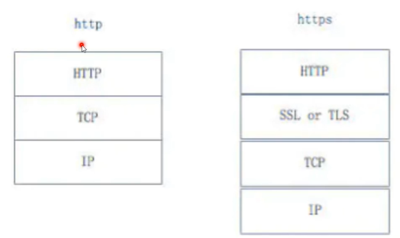
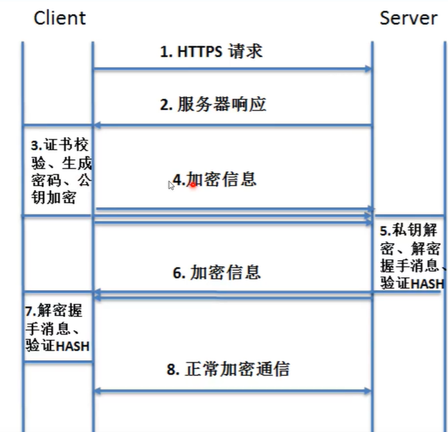
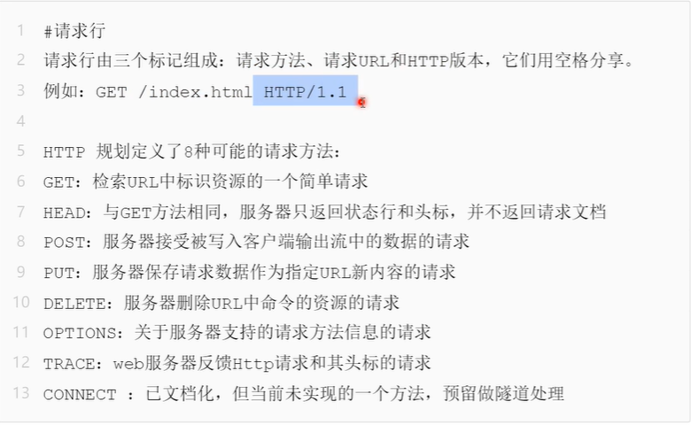
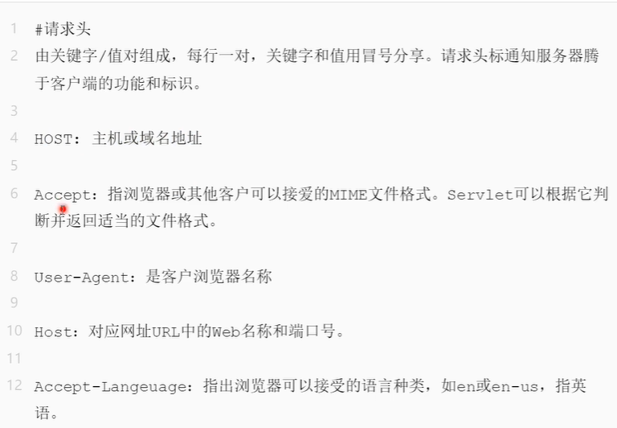
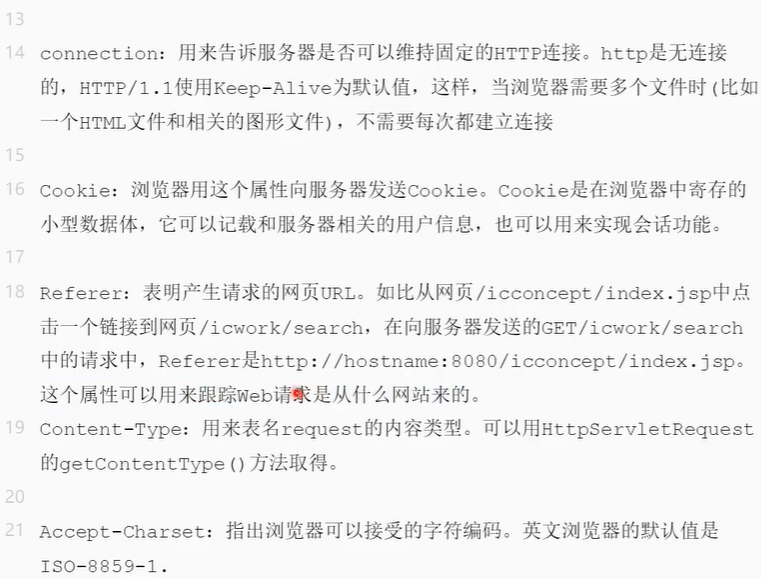
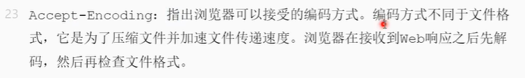
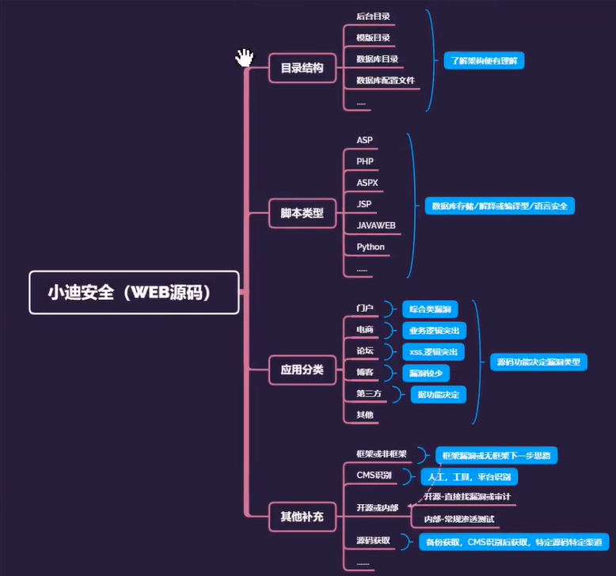
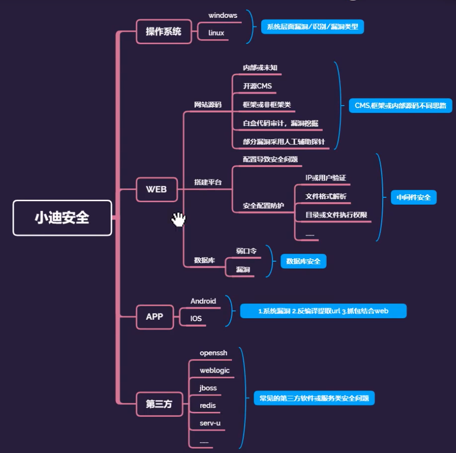

# 基础入门

## DNS

### Host和DNS的关系


## 脚本语言

### 常见脚本语言

asp **php** aspx jsp **javaweb** pl **py** cgi


## 后门

免杀


## web

### 组成

网站源码：分脚本类型、应用方向

操作系统：windows、linux

中间件（搭建平台）：apache、iis、tomcat、nginx

数据库：access、mysql、mssql、oracle、sybase、db2、postsql

​    

## web安全相关漏洞

### web源码类对应漏洞

SQL注入，文件上传，XSS，代码执行，变量覆盖，逻辑漏洞，反序列化

### web中间件对应漏洞

### web数据库对应漏洞

### web系统层对应漏洞

提权

### 其他第三方漏洞

### APP或PC应用结合类

有些app是网页套壳，可以通过工具逆向出相关网页，进行web攻击


## 数据包

### http与https



#### http

建立连接->发送请求数据包->返回响应数据包->关闭连接

#### https




### Request请求数据包

#### 请求行：请求类型/请求资源路径、协议的版本和类型



#### 请求头：一些键值对，浏览器与web服务器之间都可以发送。特定的某种含义







#### 空行：请求头与请求实体之间用一个空行隔开

最后一个请求头标之后，发送回车符和退行，通知服务器以下不再有头标

#### 请求体：请求体：要发送的数据（一般post提交会使用），例如：user=123&pass=123

使用POST传送，最常使用的是Content-Type和Content-Length头标

### Response响应数据包

#### 状态行：协议版本、数字形式的状态代码和状态描述，个元素之间以空格分隔

##### HTTP响应码

1xx	信息，请求收到，继续处理

2xx	成功，行为被成功地执行

3xx	重定向，为了完成请求，必须进一步执行的动作

4xx	客户端错误

5xx	服务端错误


200	存在文件

403	存在文件夹

3xx	均可能存在

404	不存在文件及文件夹

500	均可能存在

#### 响应头标：包含服务器类型、日期、长度、内容类型等

和请求头标一样，它们指出服务器的功能，标识出相应的细节

#### 空行响应头与响应体之间用空行隔开

最后一个响应头标之后是一个空行，发送回车符和退行，通知服务器以下不再有头标

#### 响应数据：浏览器会将实体内容中的数据取出来，生成相应页面

HTML文档和图像等，也就是HTML本身


## 源码



ASP，PHP，ASPX，JSP，JAVAWEB等脚本类型源码安全问题

社交，论坛，门户，第三方，博客等不同的代码机制对应漏洞

开源，为开源问题，框架（找框架漏洞）非框架（找代码漏洞）问题，关于CMS（开源程序，能在网上找到源码，可在网上查找这些开源代码的漏洞）识别问题及后续等


## 渗透思路




## 系统

判断系统：在URL中替换大小写，win下不区分，liunx下区分


### nmap  


## 数据库

ASP+Access

php+mysql

aspx+mssql

jsp+mssql,oracle

python+mongodb

### 常见端口

mysql	3306

oracle	1521

sqlsever	1433

## 加密编码算法

实际应用URL地址参数加密

搜索特定关键字加密字符串

```url
inurl:id=MQ==
MQ==是BASE64编码的1
```

